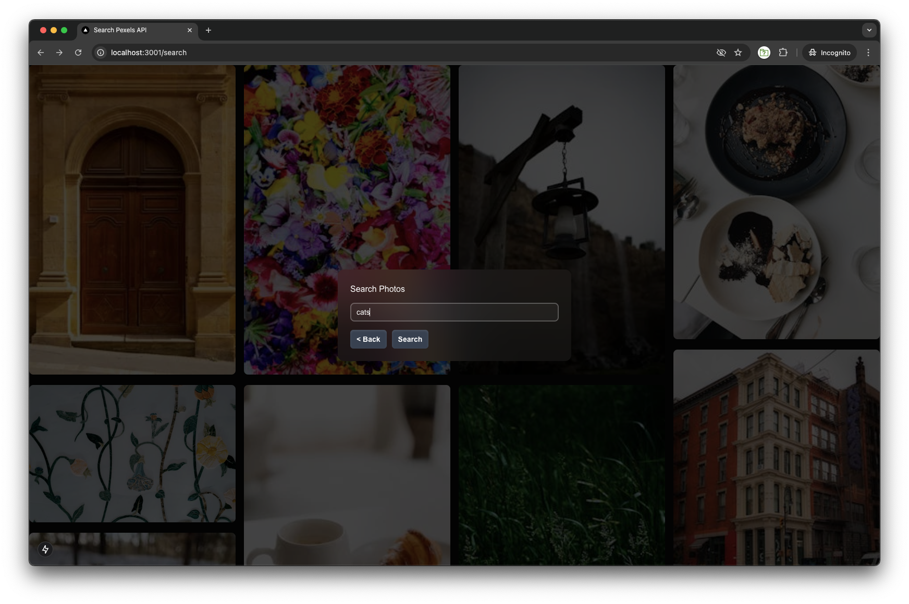
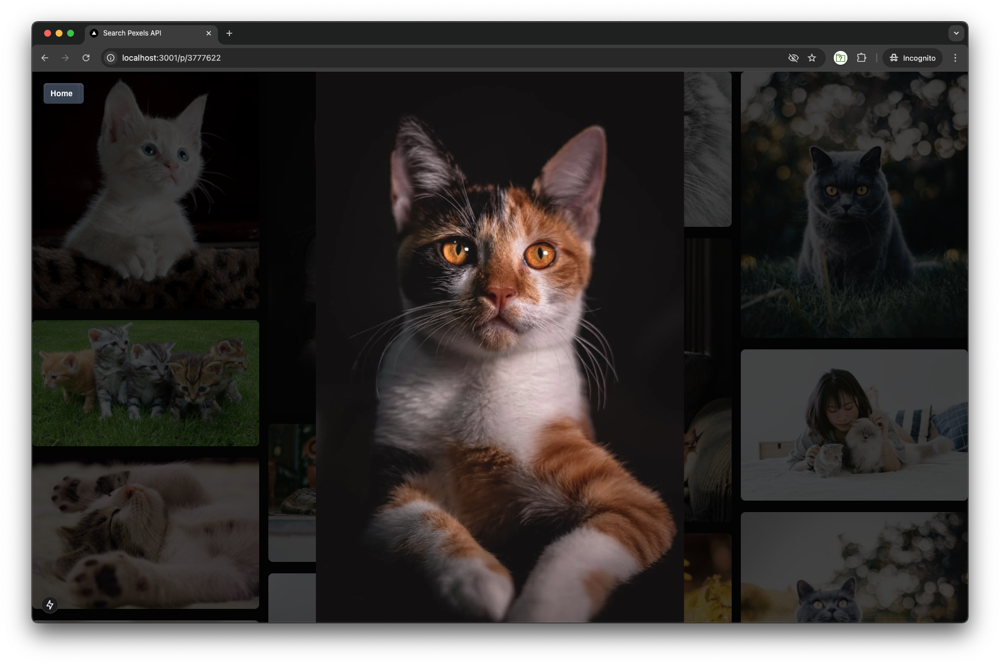
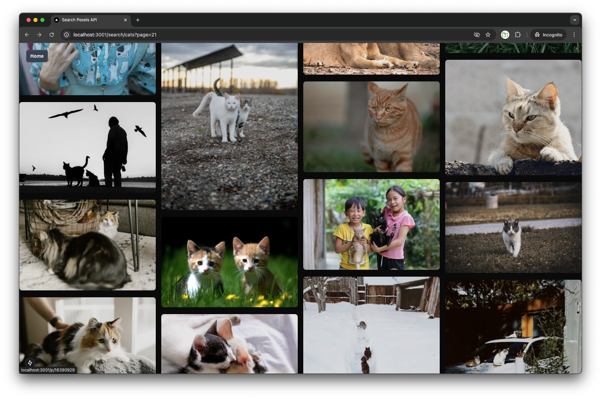

# Pexels Integration Demo

This is a demo of integration with a third party image search provider Pexels

## Requirements

- Backend 
  - ```Redis``` running on ```localhost:6379``` or
  - ```REDIS_HOST```, ```REDIS_USER```, ```REDIS_PASS``` and ```REDIS_PORT``` environment variables
  - ```PEXELS_API_KEY``` environment variable
  - ```PORT``` environment variable
  - ```QUEUE_CONSUMER``` environment variable set to ```true```
  - ```API_PRODUCER``` environment variable set to ```true```
  - Run with
  ``` yarn ```
  ``` yarn start ```

- Frontend
  - ```PORT``` environment variable
  - ```API_URL``` environment variable pointing to the backend ```http://localhost:3000/```
  - Run with
  ``` yarn ```
  ``` yarn dev ```

## Project Structure:

- ```pexels-api```

  This is the repo for the backend integration with Pexels a free image stock, using a queue to process images without breaking the rate limits of the api. Features:
  - Microservices with Redis Pub/Sub
  - Redis Bull Queues
  - Redis Caching
  - Scheduling with Cron Jobs
  - ```pexels-api/src/app.module.ts``` > ```pexels-api/src/pexels.controller.ts``` - api + queue producer + sub
  - ```pexels-api/src/micro.module.ts``` > ```pexels-api/src/pexels.service.ts``` - queue consumer + scheduling + pub
  

- ```pexels-grid```

  is the frontend created in react and nextjs with the following features:
  - Paginated virtual grid
  - Server-Side Rendering
  - Search
  - SPA Routing
  - Nested Routing

## Docker Compose

#### The easiest way to run is using docker compose and prebuilt images from dockerhub
``` 
git clone git@github.com:danilaplee/next-nest.git
cd next-nest
PEXELS_API_KEY='paste-your-apikey' REDIS_VOLUME_PATH=$(pwd)/redis PUBLIC_API_URL='http://localhost:5256/' REDIS_PASSWORD='yourpassword123' docker compose up 
open http://localhost:5257
```

## Screenshots:




